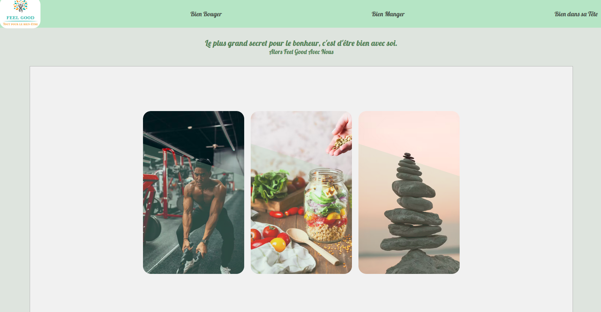

# Feel Good
Project #2 wild code school using API with React Js.


    Home Page
 


Before starting, install the dependencies and the pre-commit hooks with :

```bash
npm ci

npm run prepare

```

To launch the live server :

```bash
npm run dev

```


