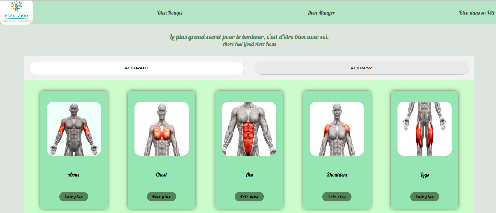
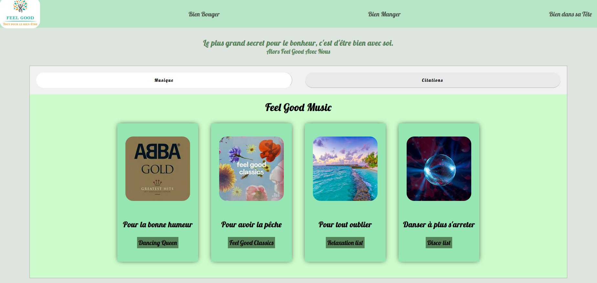
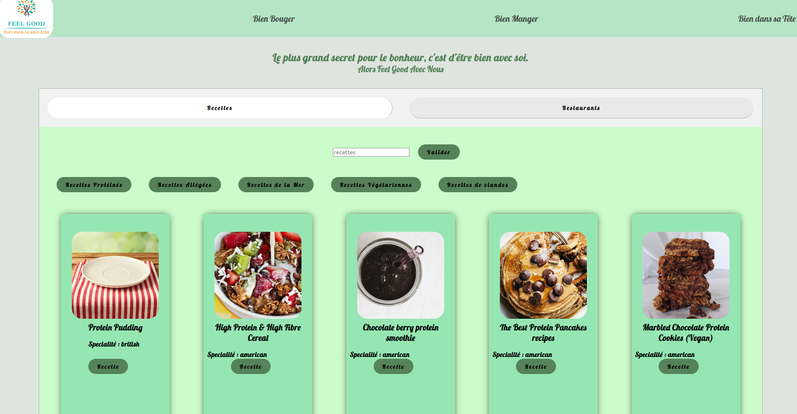

# Feel Good
Project #2 wild code school using API with React Js.


   

**Home Page**

 
   

**Bien Bouger page**


   

**Bien dans sa tête page**


   

**Bien manger page**

## Before starting


Before starting, install the dependencies and the pre-commit hooks with :

```bash
npm ci

npm run prepare

```

To launch the live server :

```bash
npm run dev

```


